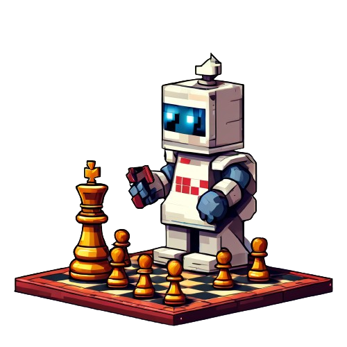

# DIALOGFLOW CHESSBOT

### O Dialogflow ChessBot é um projeto que usa os recursos do Dialogflow ES (Recurso Free oferecido pela Google Cloud) e sua API.  

   <a src="https://cloud.google.com/dialogflow/es/docs/quick/api?hl=pt-br#detect-intent-text-drest">Sobre a API</a>

---

## Objetivo

<h3>O principal objetivo do ChessBot é interagir com o usuário dando dicas de como evoluir no jogo.</h3>

<h3>Baseado nisto, pensei em um fluxo de conversa que não seja chato e ofereça uma conversa humanizada (dentro do possível).</h3>

----

## Requisitos

## Diagramas

## Tecnologias

## Usar com o seu próprio Agente

## Desenvolvedor